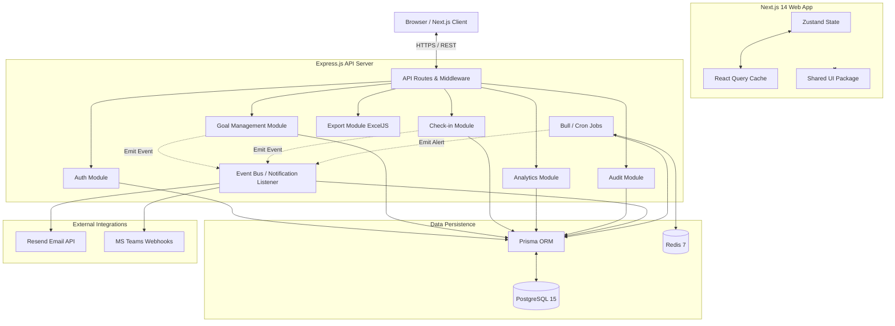

<!-- <div align="center">
  
  <h1>AtomPulse</h1>
  <p><strong>Enterprise Performance & Goal Intelligence Platform</strong></p>
  <p><em>Built for AtomQuest Hackathon 1.0</em></p>

  [](https://nextjs.org/)
  [](https://expressjs.com/)
  [](https://postgresql.org)
  [](https://prisma.io)
  [](https://typescriptlang.org)
</div>

---

## 🚀 Live Demo
**URL:** [https://atompulse-demo.render.com](https://atompulse-demo.render.com)

### Demo Credentials (All Passwords: `AtomPulse@2025`)
| Role | Email | Use Case |
|------|-------|----------|
| **Employee** | `employee@atompulse.com` | Create goals, log check-ins, track progress |
| **Manager** | `manager@atompulse.com` | Review/Approve goals, provide check-in feedback, team overview |
| **Admin/HR** | `admin@atompulse.com` | System configuration, Analytics, Shared Goals, Audit Logs |

*(Quick-login badges are available on the sign-in page to switch contexts instantly during the demo!)*

---

## 📖 Executive Summary
**AtomPulse** is a deployment-ready, full-stack web application designed to support the complete lifecycle of employee performance goals. It enforces strict business rules (e.g., 100% total weightage, check-in windows, lock mechanisms) while presenting a premium, Jira/Notion-inspired UI experience.

---

## ✨ Features

### Phase 1: Core Goal Management
- **Goal Sheet Lifecycle:** Draft -> Submitted -> Approved -> Locked -> Returned.
- **Complex Business Rules Engine:** Enforces weightage constraints (10% min, exactly 100% total), maximum goals per sheet (8), and prevents editing post-approval without HR intervention.
- **Quarterly Check-ins:** Configurable check-in windows per quarter where progress scores are automatically computed based on 4 distinct UOM formulas (Min, Max, Timeline, Zero-based).

### Phase 2: Manager & Admin Capabilities
- **Manager Kanban Review:** Managers review pending goals in a clean slide-over panel, editing weightages inline or returning sheets with feedback.
- **Shared Goals Architecture:** Admins can "Push" organizational goals to entire departments. Child goals auto-sync progress when the primary owner logs an achievement.
- **Audit Trail & Governance:** Immutable audit logs tracking every change to a locked goal sheet.

### Phase 3: Advance Features
- **Automated Escalation Engine:** Bull+Redis cron jobs detect overdue submissions and approvals, escalating up the management chain.
- **Analytics Dashboard:** Recharts-powered visualization of completion rates, QoQ trends, and manager effectiveness.
- **XLSX Exports:** ExcelJS implementation for downloading highly formatted achievement reports.
- **Event-Driven Notifications:** Real-time in-app notifications and email integration (Resend).

---

## 🏗 Architecture & Repository Structure

This project uses a **Turborepo** monorepo structure.

```text
atompulse/
├── apps/
│   ├── web/           # Next.js 14 App Router (Frontend)
│   └── api/           # Express.js API (Backend)
├── packages/
│   ├── ui/            # Shared component library (shadcn/ui + Tailwind)
│   ├── db/            # Prisma schema, migrations, seed script
│   ├── types/         # Zod schemas shared across the stack
│   └── config/        # Shared ESLint & TS configs
└── infra/             # Deployment configurations (Render.com)
```

### Architecture Diagram
See [docs/architecture.md](./docs/architecture.md) for the detailed flow.

---

## 🚀 Local Development

### Prerequisites
- Node.js 20+ → https://nodejs.org
- PostgreSQL 15+ → https://postgresql.org (or use Neon free cloud DB)
- Redis 7+ → https://redis.io (or use Upstash free cloud Redis)

### Setup

```bash
# 1. Clone the repo
git clone https://github.com/Hcxgraphics/ATOMPulse.git
cd ATOMPulse

# 2. Set up environment variables
cp apps/api/.env.example apps/api/.env
cp apps/web/.env.example apps/web/.env.local
# → Edit both files with your DB + Redis URLs

# 3. Install all dependencies
npm install

# 4. Set up database (run migrations + seed demo data)
npm run db:migrate
npm run db:seed

# 5. Start development servers
npm run dev
```

### 🌐 Access
- **Web App:** http://localhost:3000
- **API:** http://localhost:4000
- **Prisma Studio (DB GUI):** `npm run db:studio` → http://localhost:5555

### 🔑 Demo Credentials
| Role | Email | Password |
|---|---|---|
| Employee | employee@atompulse.com | AtomPulse@2025 |
| Manager | manager@atompulse.com | AtomPulse@2025 |
| Admin | admin@atompulse.com | AtomPulse@2025 |

---

## 🛡 License
MIT License. Created for the AtomQuest Hackathon 1.0. -->


<div align="center">


# ATOMPULSE

### Enterprise Goal Intelligence & Performance Management Platform

<p align="center">
ATOMPulse is a modern enterprise grade workforce performance ecosystem designed for intelligent goal governance, quarterly check-ins, workflow automation, escalations, analytics, and organization-wide alignment.
</p>

<p align="center">
Built for <strong>ATOMQUEST Hackathon 1.0</strong>
</p>

<br/>

[](https://nextjs.org/)
[](https://expressjs.com/)
[](https://postgresql.org)
[](https://prisma.io)
[](https://typescriptlang.org)
[](https://redis.io/)
[](https://tailwindcss.com/)
[]()

</div>

---

# ✨ Overview

ATOMPulse is a fullstack enterprise performance platform engineered to streamline the complete employee goal lifecycle from goal creation and approval workflows to quarterly tracking, escalations, governance, and analytics.

Inspired by modern workflow tools like Jira and Trello, the platform combines intelligent workflow orchestration, role-based access control, real-time dashboards, audit governance, and event-driven architecture into a scalable enterprise ecosystem.

---

# 🚀 Current System Status

> ATOMPulse currently implements a modular enterprise-ready architecture with active workflow integrations and governance infrastructure.

## ✅ Fully Functional Modules

* JWT Authentication & Role Based Access (RBAC)
* Enterprise Portal Shell
* Dynamic Sidebar Navigation
* Escalation Engine APIs
* Audit Governance System
* Real Time Admin Workflows
* Modular Backend API Architecture
* Monorepo Infrastructure
* Role aware UI Rendering
* API-driven Escalation Management

---

# 🖥 Dashboard Preview


---

# 🧠 Enterprise Features

## 🔐 Role-Based Enterprise Access (RBAC)

ATOMPulse implements a structured organizational hierarchy with role-aware workflows:

| Role       | Capabilities                                          |
| ---------- | ----------------------------------------------------- |
| Employee   | Goal creation, quarterly updates, progress tracking   |
| Manager    | Team review workflows, approvals, feedback management |
| Admin / HR | Governance, escalations, analytics, audit visibility  |

---

## 📌 Goal Lifecycle Management

* Draft → Submitted → Approved → Locked workflow
* Weightage validation engine
* Goal locking & governance
* Shared organizational goals
* Quarterly progress tracking
* Planned vs Actual achievement workflows

---

## ⚡ Workflow Automation

* Jira/Trello-inspired Kanban workflows
* Inline manager approvals
* Escalation management engine
* Event-driven processing architecture
* Real-time workflow state updates

---

## 📊 Enterprise Analytics & Governance

* Audit trail tracking
* QoQ performance visualization
* Completion dashboards
* Department heatmaps
* Goal distribution analytics
* Manager effectiveness insights

---

## 🔔 Smart Notification Infrastructure

* Event-driven notifications
* Real-time activity workflows
* Escalation reminders
* Redis queue architecture
* Email integration ready

---

# 🏗 System Architecture

ATOMPulse follows a modular enterprise-grade monorepo architecture optimized for scalability, governance, and maintainability.

---

## ⚙ Tech Stack

| Layer            | Technology                                     |
| ---------------- | ---------------------------------------------- |
| Frontend         | Next.js 14, TypeScript, TailwindCSS, shadcn/ui |
| Backend          | Express.js, Node.js                            |
| Database         | PostgreSQL + Prisma ORM                        |
| Queue Engine     | Redis + BullMQ                                 |
| State Management | Zustand                                        |
| Analytics        | Recharts                                       |
| Validation       | Zod                                            |
| Authentication   | JWT + RBAC                                     |
| Deployment       | Vercel / Render                                |

---

# 📦 Monorepo Structure

```bash
atompulse/
│
├── apps/
│   ├── web/                # Next.js Frontend
│   └── api/                # Express.js Backend
│
├── packages/
│   ├── ui/                 # Shared UI Components
│   ├── db/                 # Prisma Schema & DB Layer
│   ├── types/              # Shared Zod Schemas
│   └── config/             # Shared Configurations
│
└── infra/
    ├── deployment/
    ├── scripts/
    └── docker/
```

---

# 📌 Implemented Functional Workflows

## ✅ Authentication System

* JWT-based login
* Zustand auth store
* Role-aware navigation
* Logout handling
* Protected dashboard redirects

---

## ✅ Escalation Engine

* Escalation fetch APIs
* Escalate / Resolve actions
* Status-aware workflow handling
* API-driven admin operations

---

## ✅ Audit Governance System

* Audit timeline rendering
* Event statistics
* Actor tracking
* Refreshable activity logs

---

## ✅ API Infrastructure

* Authentication APIs
* Goal management APIs
* Check-in APIs
* Analytics APIs
* Audit APIs
* Escalation APIs

---

# 🚧 Active Workflow Integrations

The following enterprise workflows are currently being integrated with backend services:

* Goal Sheet Submission Flow
* Quarterly Check-in Engine
* Manager Review Workflows
* Analytics Data Binding
* Notification Center
* Search Infrastructure
* XLSX Export Engine
* Shared Goal Synchronization

---

# AtomPulse Architecture

High-level architecture of AtomPulse.




# 🌐 Demo Credentials

### Shared Password

```bash
AtomPulse@2025
```

| Role       | Email                                                   |
| ---------- | ------------------------------------------------------- |
| Employee   | [employee@atompulse.com](mailto:employee@atompulse.com) |
| Manager    | [manager@atompulse.com](mailto:manager@atompulse.com)   |
| Admin / HR | [admin@atompulse.com](mailto:admin@atompulse.com)       |

---

# 🚀 Local Development Setup

## Prerequisites

* Node.js 20+
* PostgreSQL 15+
* Redis 7+

---

## Installation

```bash
# Clone repository
git clone https://github.com/Hcxgraphics/ATOMPulse.git

# Navigate into project
cd ATOMPulse

# Install dependencies
npm install

# Configure environment variables
cp apps/api/.env.example apps/api/.env
cp apps/web/.env.example apps/web/.env.local

# Run Prisma migrations
npm run db:migrate

# Seed demo data
npm run db:seed

# Start development environment
npm run dev
```

---

# 🌍 Local Access

| Service       | URL                   |
| ------------- | --------------------- |
| Frontend      | http://localhost:3000 |
| Backend API   | http://localhost:4000 |
| Prisma Studio | http://localhost:5555 |

---

# 🔮 Future Roadmap

* Microsoft Entra ID (Azure AD)
* Teams Adaptive Notifications
* Google Meet Scheduling
* Predictive Performance Analytics
* AI-driven Goal Recommendations
* Real-time Collaboration Layer

---

# 👨‍💻 Built For

### ATOMQUEST Hackathon 1.0

Enterprise Goal Intelligence & Workforce Governance Challenge

---

# 📄 License

MIT License © 2026 ATOMPulse
