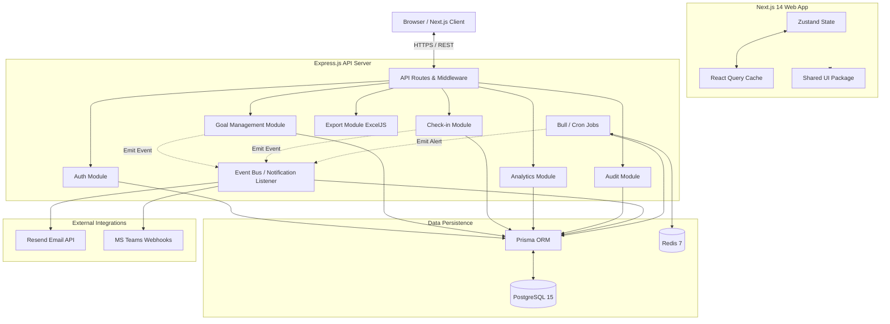

# AtomPulse Architecture

Below is the high-level architecture of AtomPulse.

```mermaid
graph TD
    %% Clients
    Browser[Browser / Next.js Client]
    
    %% Frontend Layer
    subgraph Frontend [Next.js 14 Web App]
        Zustand[Zustand State]
        ReactQuery[React Query Cache]
        UIPackage[Shared UI Package]
    end
    
    %% API Gateway / Backend Layer
    subgraph Backend [Express.js API Server]
        Router[API Routes & Middleware]
        AuthMod[Auth Module]
        GoalMod[Goal Management Module]
        CheckinMod[Check-in Module]
        AnalyticsMod[Analytics Module]
        AuditMod[Audit Module]
        ExportMod[Export Module ExcelJS]
        
        EventBus[Event Bus / Notification Listener]
        EscalationJob[Bull / Cron Jobs]
    end
    
    %% Data Layer
    subgraph Data [Data Persistence]
        PrismaORM[Prisma ORM]
        PostgreSQL[(PostgreSQL 15)]
        Redis[(Redis 7)]
    end
    
    %% External Services
    subgraph External [External Integrations]
        Resend[Resend Email API]
        MSTeams[MS Teams Webhooks]
    end

    %% Connections
    Browser <-->|HTTPS / REST| Router
    Router --> AuthMod
    Router --> GoalMod
    Router --> CheckinMod
    Router --> AnalyticsMod
    Router --> AuditMod
    Router --> ExportMod
    
    AuthMod --> PrismaORM
    GoalMod --> PrismaORM
    CheckinMod --> PrismaORM
    AnalyticsMod --> PrismaORM
    AuditMod --> PrismaORM
    
    GoalMod -.->|Emit Event| EventBus
    CheckinMod -.->|Emit Event| EventBus
    
    EventBus --> Resend
    EventBus --> MSTeams
    EventBus --> PrismaORM
    
    EscalationJob <--> Redis
    EscalationJob --> PrismaORM
    EscalationJob -.->|Emit Alert| EventBus
    
    PrismaORM <--> PostgreSQL
    
    Frontend <--> UIPackage
    Zustand <--> ReactQuery
```
